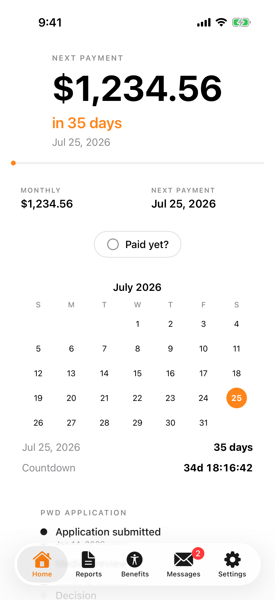
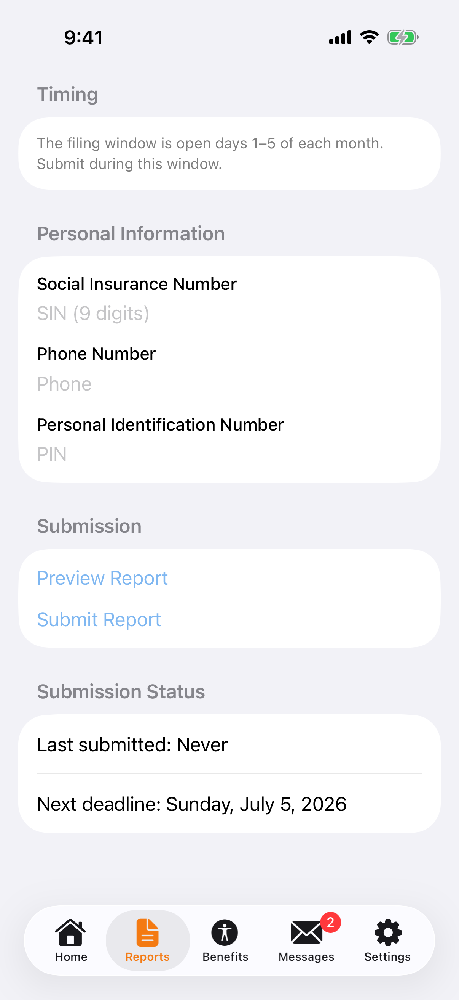
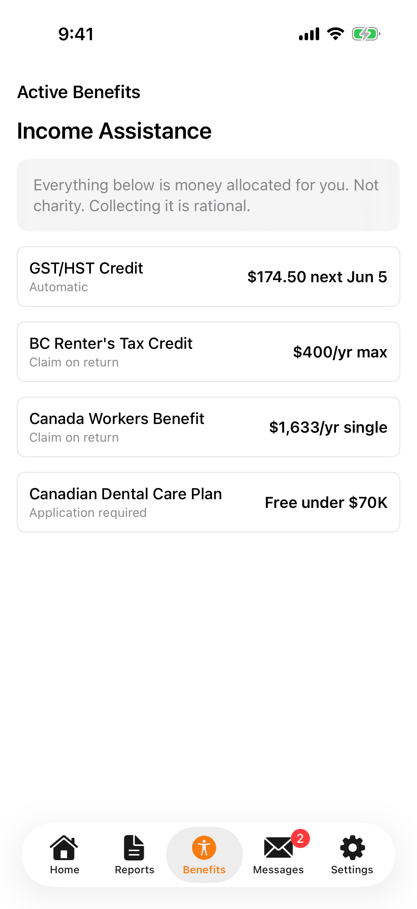
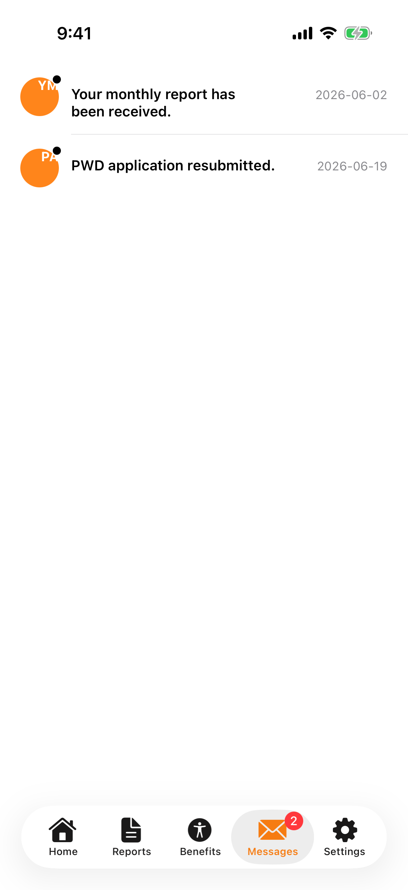
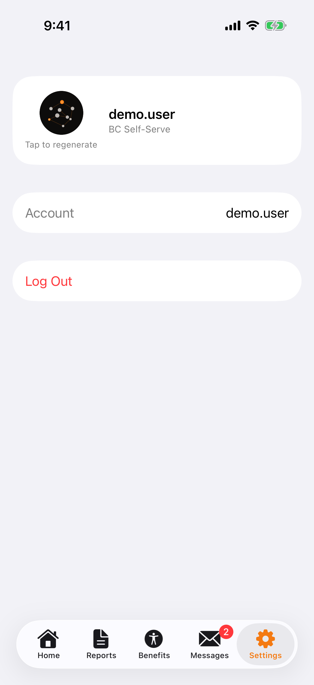
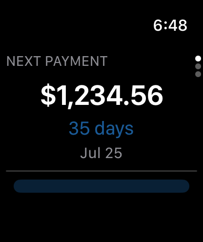

# Talli


Live at [talli.heyitsmejosh.com](https://talli.heyitsmejosh.com)

<p align="center">
  
  
  
  
  
</p>

<p align="center">
  
</p>

BC Self-Serve scraper and benefits dashboard. Tracks income, payment dates, PWD application status, and government messages.

## Features

- BC Self-Serve scraper with session-encrypted credentials
- 4-tab dashboard: Home, Calendar, Status, Messages
- Income tracking with payment countdown, "in X days" hero, and earning rate (payment ÷ hrs remaining)
- Bar chart of recent payments + YTD stats
- PWD and DTC application timeline trackers with report submission history
- Calendar view with upcoming payment schedule
- Messages with server-synced read state (load on mount, persist on tap)
- Account info panel (BCeID, SIN masked, program)
- Monthly report filing window banner (auto-shows days 1–5 of each month)
- Monthly report submission with stored PIN
- Persistent paid/report status (Vercel Blob)
- Multilingual (en, fr, zh, pa): one master string source generates both the web i18next bundle and the Xcode String Catalog, plus `Intl` CAD currency/date formatting. Benefit strings flagged for human/DeepL review.
- Dark mode auto-detect
- PWA with offline mode
- iOS companion app (parchment palette, orange accent, pixel-art avatar, top-right settings shortcut)

## Design

DM Sans (body) + Fraunces (headings), warm parchment palette (`#faf7f4` light / `#0d0c0b` dark), clrs.cc orange (`#FF851B`) accent. 430px centered shell on desktop. iOS matches web: solid cards, orange accents, 8×8 pixel-art avatar generated with Core Graphics.

## Run

```bash
npm install && npm start
```

Open http://localhost:3000. Copy `.env.example` to `.env`.

Deploy: push to `main` — GitHub Actions auto-deploys to Vercel prod on every push (see `.github/workflows/deploy.yml`).

## License

MIT 2026 Joshua Trommel

## Roadmap
- [x] Top-right avatar spins while regenerating (refresh state lifted into Screen) — both avatars animate
- [x] Hid the settings entry in the bottom nav; top-right avatar is now the settings link
- [ ] Avatar still does not persist across reloads (avatarUrl not rehydrated on load) — separate fix
- [ ] Sync mobile and web: web is missing the countdown the mobile app already has
- [ ] Improve countdown functionality and UI
- [ ] Rework the increasing-payment-per-hour model: pay is a monthly lump sum, so either remove the increasing-accrual visual or redesign it to read as a steady rate paid out monthly

### App Store submission (free, keep BC Self-Serve auto-login)
Talli ships FREE — audience is income-assistance recipients, never paywall it. It's the proof-of-competence flagship, not a revenue line.
- [x] Privacy policy page (`web/privacy.html`, live at `/privacy`)
- [x] App Store Connect listing complete (category, subtitle, age rating, content rights)
- [x] Screenshots regenerated at correct App Store resolutions (1242×2688 / 1284×2778)
- [x] Submitted for review 2026-06-20 — status: Waiting for Review
- [ ] Fix Xcode Cloud workflow: still points at old `Tally.xcodeproj`, needs repoint to `Talli.xcodeproj` in Manage Workflows
- [ ] Mac TestFlight: `fastlane mac_beta` lane added 2026-06-21, archive builds clean, but upload fails — no macOS app record exists yet in App Store Connect for `com.heyitsmejosh.tally.mac`. Create the app record (one-time, manual) then re-run `fastlane mac_beta` in `macos/fastlane`.

### macOS companion (scaffolded 2026-06-20, partially working)
- [x] Window now opens correctly — root cause was a stale macOS window-restoration state (`~/Library/Saved Application State/com.heyitsmejosh.tally.mac.savedState`) corrupted by repeated forced-quits during today's testing, not a code bug. Confirmed fixed after clearing it.
- [ ] **App icon still shows generic placeholder** in the Dock despite a correct `AppIcon.appiconset` + `ASSETCATALOG_COMPILER_APPICON_NAME` — assets/config both check out, this looks like a stale LaunchServices/Dock icon cache from rebuilding under the same bundle ID, not a code defect. Fix: after a clean rebuild, clear the cache (`killall Dock` and/or `qlmanage -r cache`) rather than chasing it as a code bug.
- [x] **Sign-in fixed** — root cause: `MacAPIClient.execute()` short-circuited every HTTP 401 to a generic "Session expired" error before decoding the body, but the server also returns 401 with the real BC Self-Serve failure reason on a fresh failed login (not just on session expiry). `login()` now decodes the body directly and surfaces `error` from the response instead of swallowing it. Verified via `xcodebuild build` (BUILD SUCCEEDED); live-credential UI test still pending.
- [x] watchOS screenshot lane works and is verified (real payment data, not blank).
- [ ] macOS screenshot still pending — re-add once the icon cache issue above is cleared (sign-in is no longer a blocker).
