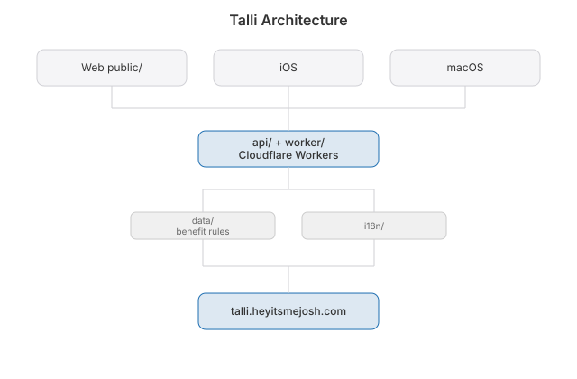

# Talli


 [](https://github.com/nulljosh/talli)

Live at [talli.heyitsmejosh.com](https://talli.heyitsmejosh.com) · [App Store](https://apps.apple.com/app/talli/id6782366555)

<p align="center">
  
  
  
  
  
</p>

<p align="center">
  
</p>

<p align="center">
  
</p>

When does the money come, and how much? Talli answers that for people on BC income assistance.

It reads BC Self-Serve for you and shows income, payment dates, PWD application status and government messages in one place. Free, always.

## Features

- Reads BC Self-Serve. Credentials are encrypted per session
- Four tabs: Home, Calendar, Status, Messages
- A countdown to the next payment, and what you're earning per hour until it lands
- Recent payments as a bar chart, plus year to date
- PWD and DTC application timelines, with report history
- A calendar of what's coming
- Messages, with read state synced to the server
- Account panel: BCeID, program, SIN masked
- A filing-window banner on days 1 to 5 of each month
- File the monthly report with a stored PIN
- Paid and report status that survives reloads (Vercel Blob)
- English, French, Chinese, Punjabi. One string source feeds the web i18next bundle and the Xcode String Catalog, with `Intl` for CAD and dates. Benefit strings are flagged for human or DeepL review
- Dark mode follows the system
- Installs as a PWA, works offline
- An iOS app: parchment palette, orange accent, pixel-art avatar, settings top right

## Design

DM Sans for body, Fraunces for headings. The portfolio palette: `#ffffff` light, `#1a1a1a` dark, blue `#5B9BD5` accent. A 430px shell centered on desktop. iOS matches: solid cards, blue accents, a node-graph avatar drawn with Core Graphics.

## Run

```bash
npm install && npm start
```

Open http://localhost:3000. Copy `.env.example` to `.env`.

Deploy: push to `main`. GitHub Actions ships it on every push (`.github/workflows/deploy.yml`).

## License

MIT 2026 Joshua Trommel

## This Week / This Month

**This week**
- [ ] Watch iOS v3.5.6 clear App Store review (submitted 2026-07-19: login/splash theme fix, Status Messages removed, What's New truncation fix, dynamic CRA dates)
- [ ] Fix Xcode Cloud workflow pointing at old `Tally.xcodeproj`
- [ ] Avatar persistence bug (avatarUrl not rehydrated)

**This month**
- [ ] macOS App Store submission (app record + `mac_beta` upload)
- [ ] Sync mobile/web countdown feature gap
- [ ] Rework increasing-payment-per-hour model (lump sum, not accrual)

## Roadmap
- [ ] Avatar still does not persist across reloads (avatarUrl not rehydrated on load)
- [ ] Sync mobile and web: web is missing the countdown the mobile app already has
- [ ] Improve countdown functionality and UI
- [ ] Rework the increasing-payment-per-hour model: pay is a monthly lump sum, so either remove the increasing-accrual visual or redesign it to read as a steady rate paid out monthly

### App Store submission (free, keep BC Self-Serve auto-login)
Talli is free. The people who use it are on income assistance. Never paywall it. It's the flagship, not a revenue line.
- [ ] Fix Xcode Cloud workflow: still points at old `Tally.xcodeproj`, needs repoint to `Talli.xcodeproj` in Manage Workflows
- [ ] Mac TestFlight: `fastlane mac_beta` lane added 2026-06-21, archive builds clean, but upload fails, no macOS app record exists yet in App Store Connect for `com.heyitsmejosh.tally.mac`. Create the app record (one-time, manual) then re-run `fastlane mac_beta` in `macos/fastlane`.

### macOS companion
- [ ] **App icon still shows generic placeholder** in the Dock, stale LaunchServices/Dock icon cache. Fix: clean rebuild, then `killall Dock` and/or `qlmanage -r cache`.
- [x] macOS screenshot captured (`macos/screenshots/dashboard.png`, 2026-08-31).

## Whitepaper

[Technical whitepaper](WHITEPAPER.md)

## API and agent tools

[`docs/API.md`](docs/API.md) lists the HTTP surface and the WebMCP tools Talli registers
on `document.modelContext`. An agent can read benefit status and payments and, with your
say-so, file the monthly report.

Credentials never pass through a tool. No tool sets the PIN. `submit_monthly_report` takes
no SIN, phone or PIN. `tools/test-webmcp.js` enforces both and runs first in `npm test`.

## Architecture


