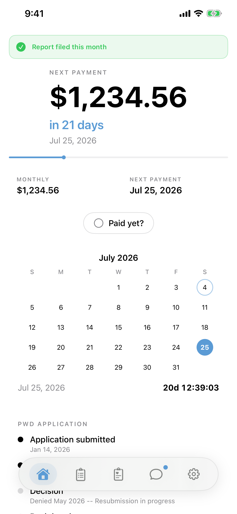
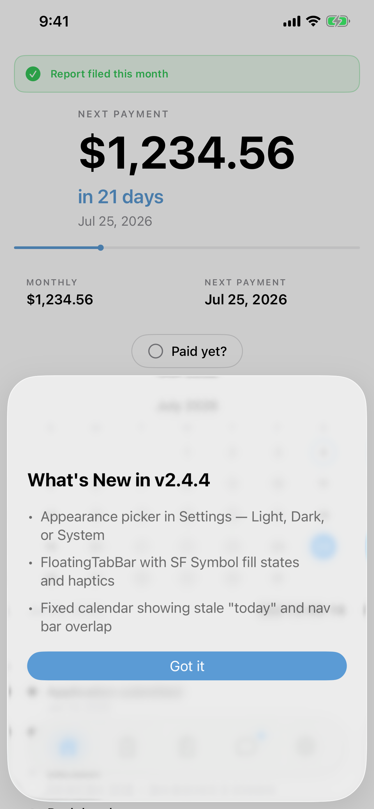
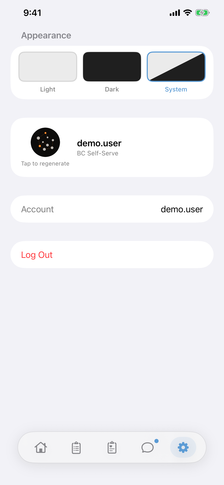
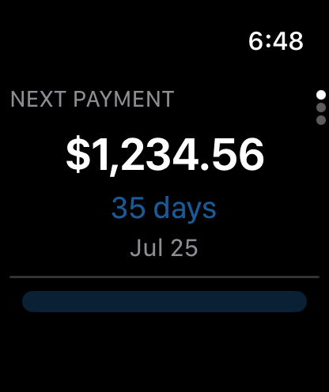

# Talli


 [](https://github.com/nulljosh/talli)

Live at [talli.heyitsmejosh.com](https://talli.heyitsmejosh.com) · [App Store](https://apps.apple.com/app/talli/id6782366555)

<p align="center">
  
  
  
  
  
</p>

<p align="center">
  
</p>

BC Self-Serve scraper and benefits dashboard. Tracks income, payment dates, PWD application status, and government messages.

## Features

- BC Self-Serve scraper with session-encrypted credentials
- 4-tab dashboard: Home, Calendar, Status, Messages
- Income tracking with payment countdown, "in X days" hero, and earning rate (payment ÷ hrs remaining)
- Bar chart of recent payments + YTD stats
- PWD and DTC application timeline trackers with report submission history
- Calendar view with upcoming payment schedule
- Messages with server-synced read state (load on mount, persist on tap)
- Account info panel (BCeID, SIN masked, program)
- Monthly report filing window banner (auto-shows days 1–5 of each month)
- Monthly report submission with stored PIN
- Persistent paid/report status (Vercel Blob)
- Multilingual (en, fr, zh, pa): one master string source generates both the web i18next bundle and the Xcode String Catalog, plus `Intl` CAD currency/date formatting. Benefit strings flagged for human/DeepL review.
- Dark mode auto-detect
- PWA with offline mode
- iOS companion app (parchment palette, orange accent, pixel-art avatar, top-right settings shortcut)

## Design

DM Sans (body) + Fraunces (headings), portfolio palette (`#ffffff` light / `#1a1a1a` dark), blue (`#5B9BD5`) accent. 430px centered shell on desktop. iOS matches web: solid cards, blue accents, node-graph avatar generated with Core Graphics.

## Run

```bash
npm install && npm start
```

Open http://localhost:3000. Copy `.env.example` to `.env`.

Deploy: push to `main` — GitHub Actions auto-deploys to Vercel prod on every push (see `.github/workflows/deploy.yml`).

## License

MIT 2026 Joshua Trommel

## This Week / This Month

**This week**
- [ ] Watch iOS v3.5.6 clear App Store review (submitted 2026-07-19: login/splash theme fix, Status Messages removed, What's New truncation fix, dynamic CRA dates)
- [ ] Fix Xcode Cloud workflow pointing at old `Tally.xcodeproj`
- [ ] Avatar persistence bug (avatarUrl not rehydrated)

**This month**
- [ ] macOS App Store submission (app record + `mac_beta` upload)
- [ ] Sync mobile/web countdown feature gap
- [ ] Rework increasing-payment-per-hour model (lump sum, not accrual)

## Roadmap
- [ ] Avatar still does not persist across reloads (avatarUrl not rehydrated on load)
- [ ] Sync mobile and web: web is missing the countdown the mobile app already has
- [ ] Improve countdown functionality and UI
- [ ] Rework the increasing-payment-per-hour model: pay is a monthly lump sum, so either remove the increasing-accrual visual or redesign it to read as a steady rate paid out monthly

### App Store submission (free, keep BC Self-Serve auto-login)
Talli ships FREE — audience is income-assistance recipients, never paywall it. It's the proof-of-competence flagship, not a revenue line.
- [ ] Fix Xcode Cloud workflow: still points at old `Tally.xcodeproj`, needs repoint to `Talli.xcodeproj` in Manage Workflows
- [ ] Mac TestFlight: `fastlane mac_beta` lane added 2026-06-21, archive builds clean, but upload fails — no macOS app record exists yet in App Store Connect for `com.heyitsmejosh.tally.mac`. Create the app record (one-time, manual) then re-run `fastlane mac_beta` in `macos/fastlane`.

### macOS companion
- [ ] **App icon still shows generic placeholder** in the Dock — stale LaunchServices/Dock icon cache. Fix: clean rebuild, then `killall Dock` and/or `qlmanage -r cache`.
- [ ] macOS screenshot still pending — icon cache issue is the only blocker.

## Whitepaper

[Technical whitepaper](WHITEPAPER.md)

## API and agent tools

[`docs/API.md`](docs/API.md) documents the full HTTP surface and the WebMCP tools
Talli registers on `document.modelContext`, so an in-browser agent can read
benefit status and payments and, with confirmation, file the monthly report.

Credentials never pass through a tool call: no tool sets the security PIN, and
`submit_monthly_report` takes no SIN, phone or PIN argument. `tools/test-webmcp.js`
enforces both and runs first in `npm test`.
