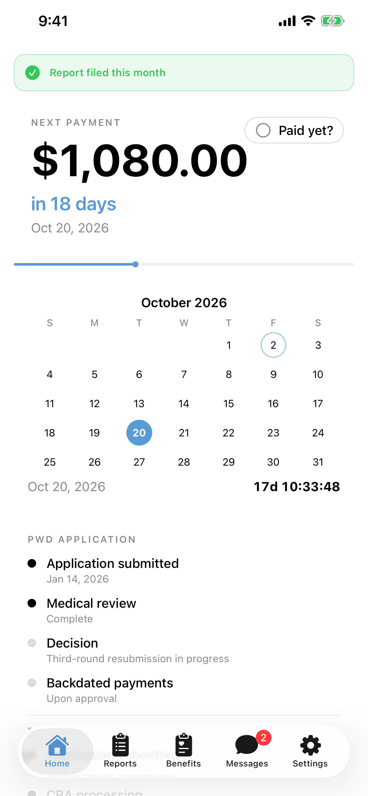
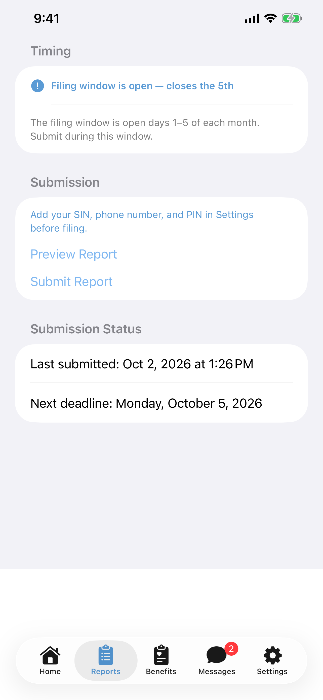
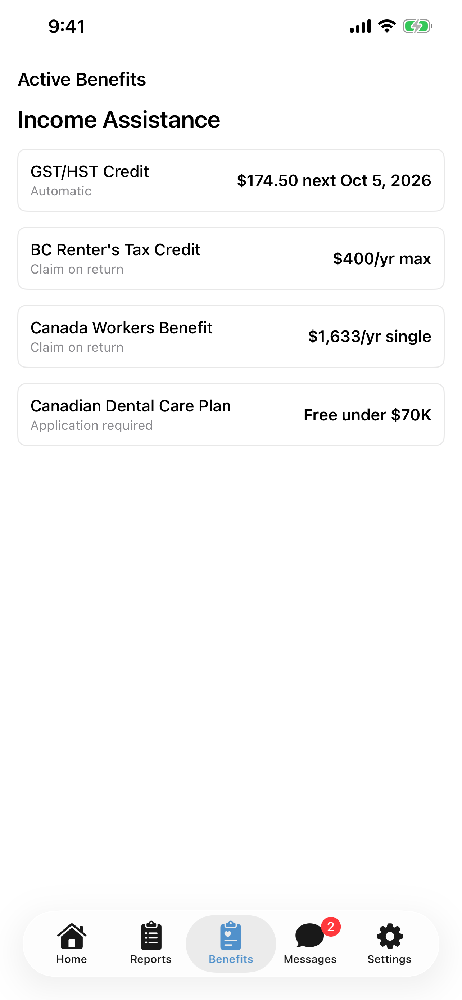
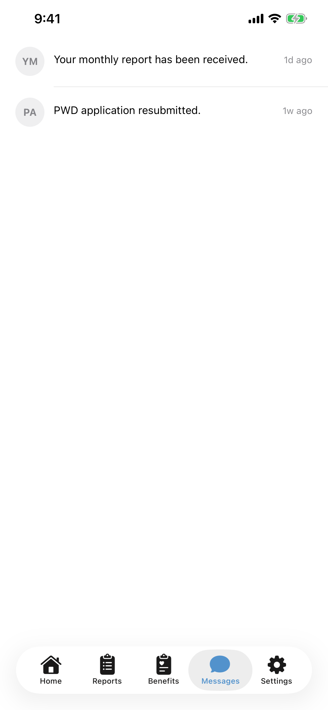
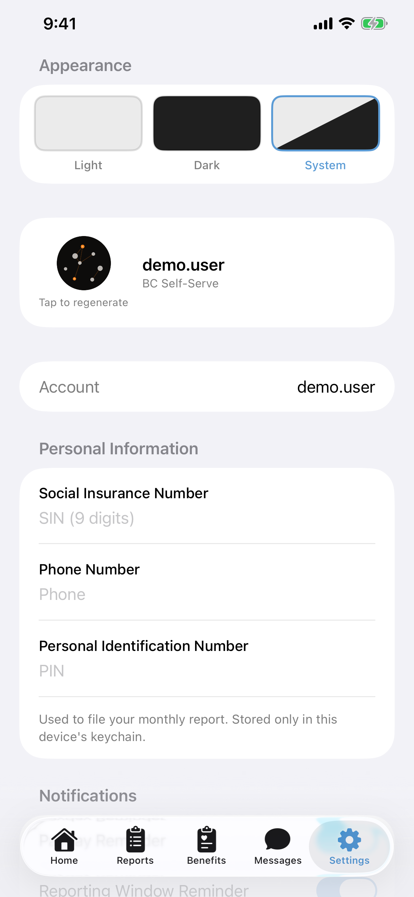
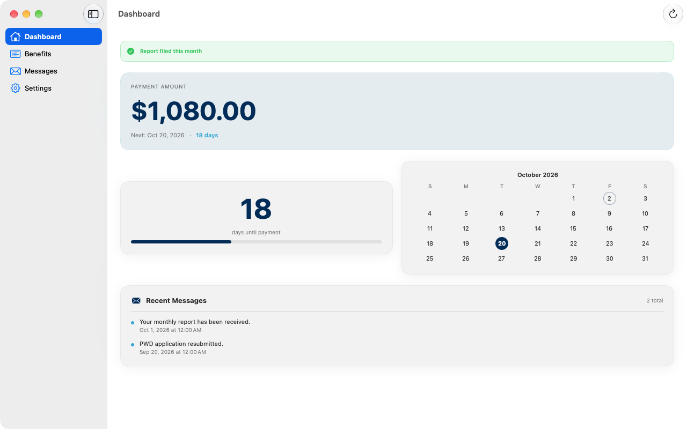
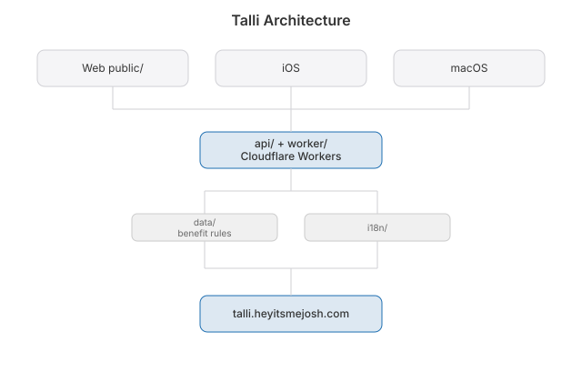

# Talli


 [](https://github.com/nulljosh/talli)

Live at [talli.heyitsmejosh.com](https://talli.heyitsmejosh.com) · [App Store](https://apps.apple.com/app/talli/id6782366555)

<p align="center">
  
  
  
  
  
</p>

<p align="center">
  
</p>

When does the money come? How much?

Talli answers that for people on BC income assistance.

It reads BC Self-Serve for you. Payments, dates, messages, PWD status. One place.

Free. Always.

## What it does

- Countdown to the next payment.
- Monthly income, PWD plus CDB.
- Messages, read on your phone, read everywhere.
- File the monthly report.
- Reminders on payday and when the report window opens.
- Widgets on iPhone and Mac.
- English, French, Chinese, Punjabi.

iPhone, Mac, Apple Watch and web.

## Run

```bash
npm install && npm start
```

Open http://localhost:3000. Copy `.env.example` to `.env`.

Runs on Cloudflare Workers. Deploy with `npx wrangler deploy`.

## More

[Whitepaper](WHITEPAPER.md) · [API and agent tools](docs/API.md) · [Roadmap](roadmap.md)



## License

MIT 2026 Joshua Trommel
