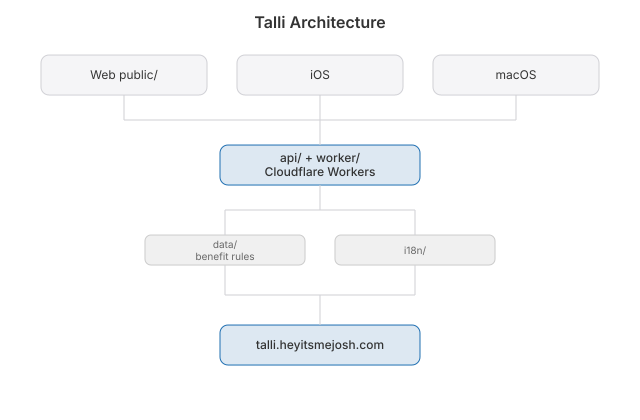

<p align="center">
  
  
</p>

When does the money come? How much?

Talli answers that for people on BC income assistance. It reads BC Self-Serve for you and puts one number on the screen: your next payment.

Free. Always.

## Four tabs

- **Home**: the next payment in SF Pro Rounded, the days left, Mark as paid and the next paydays. Totals sit under Details.
- **Status**: PWD, RDSP and CDB, and the tools: log money, budget, benefit finder, RDSP, what if, household and more.
- **Messages**: your Self-Serve messages, newest first, read state shared across devices.
- **Settings**: account, avatar, language, theme.

iPhone, Mac (macOS 13 and up), Apple Watch, and the web, which installs on Android. English, French, Chinese and Punjabi.

## Run

```bash
npm install && npm start
```

Open http://localhost:3000. Copy `.env.example` to `.env`. Runs on Cloudflare Workers; deploy with `npm run deploy`.

Apple apps: `xcodegen` then open `ios/Talli.xcodeproj` or `macos/TalliMac.xcodeproj`. On Xcode 15 (macOS 13), generate from `project.local.yml` instead (`xcodegen generate --spec project.local.yml`).

## Terminal

```bash
npm link            # puts `talli` on your PATH
talli login         # once; tries BCeID one time and keeps only a read-only token
talli               # $1,260  tomorrow  Wed, Oct 21
talli summary       # the breakdown and message count (--json for scripts)
talli tui           # full screen, the amount centred; r refreshes, q quits
```

## More

[Whitepaper](docs/WHITEPAPER.md) · [API](docs/API.md) · [Architecture](docs/ARCHITECTURE.md) · [Brand kit](brand/index.html) · [Roadmap](roadmap.md) · [Contributing](.github/CONTRIBUTING.md) · [Security](.github/SECURITY.md)



## License

Apache License 2.0. Copyright 2026 Joshua Trommel.
