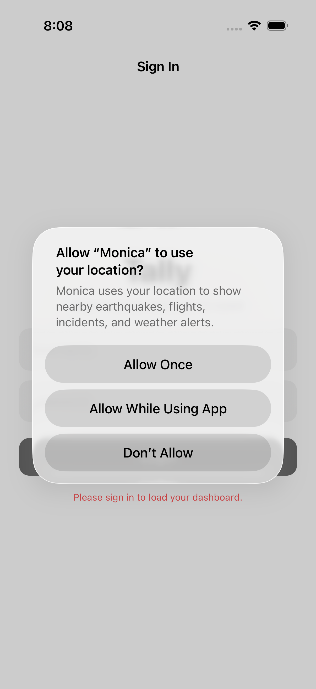

# Tally iOS


<p align="center"></p>
iOS companion for [Tally](https://github.com/nulljosh/tally), the BC benefits tracker, built with SwiftUI (iOS 17+, Swift 6), @Observable state management, URLSession cookie jar auth, xcodegen, backend https://tally.heyitsmejosh.com (Vercel + Puppeteer), architecture: SwiftUI Views -> AppState (@Observable) -> APIClient (URLSession) -> Vercel Backend -> BC Self-Serve, requires Xcode 16+ (Swift 6).
[Architecture](architecture.svg)

## Features

- 5-tab layout: Home, Benefits, Reports, Messages, Settings
- Dashboard with payment amount, countdown to 25th, payment calendar
- Benefits tab: DTC navigator, CRA workspace, RDSP guide, dispute analyzer
- Monthly report submission
- BC Self-Serve login with 2-hour session + biometric sign-in
- Offline caching with instant launch
- CSV export of dashboard data
- Apple Liquid Glass UI

## Run

```bash
xcodegen generate
open Tally.xcodeproj
```

## Roadmap

- [ ] Payment history chart (sparkline/bar)
- [ ] Document vault (encrypted storage)
- [ ] Push notifications for payment dates

## Changelog

### v2.3.0 (2026-03-28)
- Contacts sync
- PWD approval status tracker
- Benefits view updates
- Theme cleanup

### v2.2.0 (2026-03-25)
- Persistent paid toggle on dashboard (syncs with server)
- Unread message badge clears on tab open, read state persisted via API
- Models refactored to Models/ directory
- Concurrent async loads on login

### v2.1.0 (2026-03-24)
- General benefits guide (grocery rebate, GST/HST, climate credit, CWB, CCB, SAFER, PharmaCare, BC Bus Pass)
- Native SwiftUI cards
- Default tab on Benefits

### v2.0.0 (2026-03-18)
- Added RDSP guide (eligibility, key features, CRA resource links)
- Synced with tally web v2.4.0
- Major version bump

### v2.0.1 (2026-03-20)
- Redesigned app icon: dark terminal aesthetic, proper 1024x1024 scaling
- Centered clipboard + checklist design with BC gov blue palette

## License

MIT 2026 Joshua Trommel
