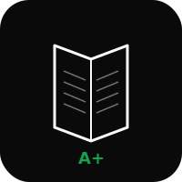

# School


D2L Brightspace grade scraper, dashboard, and homework solver for Langley SD35.

[school.heyitsmejosh.com](https://school.heyitsmejosh.com)

## Preview

| Light | Dark |
|-------|------|
|  |  |

> Monochrome portfolio aesthetic. Course tabs, category breakdowns, progress bars, and status badges. Auto dark/light mode with View Transitions API.

## Courses (2025-26)

| Course | Status | Grade |
|--------|--------|-------|
| Pre-Calculus 12 | Active -- nearly done | 97% quizzes |
| Anatomy & Physiology 12 | Active -- module exams need redo | ~50% overall |
| English 12 | Done | A+ |

## Features

- Playwright-based D2L grade scraping with staleness tracking
- Portfolio-style dashboard with auto dark/light mode
- Course status summary with completion badges
- PDF scraper, form filler, and dropbox submitter
- Homework solver (Flask + Claude/Ollama)
- Spring hover animations, fade-up scroll reveals
- Reduced motion, print styles, focus-visible accessibility

## Run

```bash
npm install && npm start                        # Express on :3000
npm run refresh                                 # Scrape grades
cd tools/solver && python app.py                # Solver on :5050
python tools/scrape_pdfs.py submit              # Submit filled PDFs
```

D2L credentials: macOS Passwords app (`microsoftonline.com`, `jtrommel7240@langleyschools.ca`) or `.env`.

Deploy: Vercel -- school.heyitsmejosh.com

## Roadmap

- [ ] Migrate to Cloudflare Workers
- [ ] Auto-refresh grades on cron and push notifications for new grades
- [ ] Assignment calendar view
- [ ] Redo 3 Anatomy unit tests (scheduled)

## License

MIT 2026 Joshua Trommel
